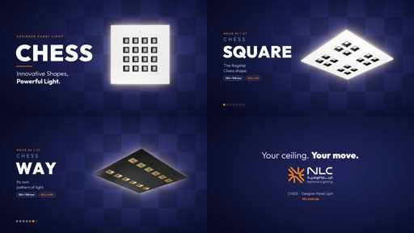

# CHESS family commercial

A 52-second, 16:9 commercial for the whole CHESS family (Square, Master, Block,
Line, Hexa, Way, Quiet), in the NLC brand palette, using the real product photos
and the master logo from nlc.com.sa.

**Rendered film:** `NLC-CHESS-family-commercial-16x9.mp4` (1920×1080, 30 fps,
H.264 + AAC, 52 s, 16 MB) is in the Higgsfield media library, media id
`d5020c4a-ba59-4278-8ecc-aca98791d02a`.



## Storyboard

| Time | Scene | On screen |
|------|-------|-----------|
| 0:00–0:05 | The board | A ceiling of panels lights up as a chessboard (each lit tile is a 4×4-cell CHESS panel). "Every ceiling is a board." |
| 0:05–0:10 | Title | CHESS MASTER powers on. "CHESS · Designer Panel Light · Innovative Shapes, Powerful Light." |
| 0:10–0:34 | Seven moves | One shape per 3.5 s, "MOVE 01 / 07" to "07 / 07": photo powers on over a lit chessboard wall, with name, one line, size and model code. A chess-piece "clack" marks each move. |
| 0:34–0:40 | Performance | 35 W · 3,500 lm · 100 lm/W · UGR<13 · CRI>80 (>90 optional) · 100,000 h L70B50. Footnote: values at 4000K, ±10%. |
| 0:40–0:45 | Options | 2700K/3000K/4000K/6500K · Recessed/Surface/Suspended · Black/Gray/White · dimming and emergency optional · 3-year warranty, extendable to 5. |
| 0:45–0:52 | Family + end card | All seven in a row: "One family. Every shape." Then "Your ceiling. Your move.", the NLC logo (light-wipe entrance, always at full opacity) and nlc.com.sa. |

Every figure comes from the live CHESS product pages. The film shows no figure
that a page does not state. For example, Quiet has no model code or exact size
on its page, so the film says "Compact panel" and nothing more.

## Re-render

Needs Python 3 with Pillow and numpy, plus ffmpeg and `rsvg-convert`.

```bash
./fetch_assets.sh                                  # photos, logo, Outfit -> ./assets
python3 chess_commercial.py --qa                   # layout/exposure checks, no render
python3 chess_commercial.py --stills 240,365,1530 --still-scale 0.5   # preview frames
python3 chess_commercial.py --out NLC-CHESS-family-commercial-16x9.mp4
```

A full render takes about 40 s on 8 cores. Copy, specs and the order of the
shapes are in the `PIECES`, `STATS` and `CCTS` tables at the top of
`chess_commercial.py`. The headline font is Outfit, because Bizmo is licensed
and not bundled.

## AI cinematic version (MINI recipe)

The LUXO and MINI commercials used Kling 3.0 image-to-video clips in Higgsfield.
The Higgsfield account had 0.61 credits when this was made, so those shots were
not generated. When credits are available, generate them with the same settings
and cut them between the scenes above.

**Clip settings (same as MINI):** `kling3_0`, mode `pro`, 16:9, `sound: off`,
`cfg_scale: 0.5`, 5 s (8–10 s for hero shots), with a start image.

**Start frames:** in Higgsfield, `media_import_url` the product photo
(`https://nlc.com.sa/images/products/chess/<key>.png`). Then use `nano_banana_2`
(16:9, 2k) with that photo as `image_references` and this prompt:

> Photorealistic architectural interior photograph, {SCENE}. The ceiling
> luminaire is the exact product in the attached image ({SHAPE NOTE}), with the
> same shape, body colour, cell pattern and proportions. Warm 3000K light, deep
> navy shadows, premium Saudi interior, Sony A7R IV, 24mm, f/5.6. No people, no
> text, no signage, no logos, no watermark.

**Motion prompt suffix (copy from MINI):**

> Cinematic editorial commercial, Sony A7R IV look, 24fps, shallow depth of
> field, warm 3000K light, deep navy shadows, teal-and-orange cinematic grade.
> The fixture keeps its exact shape, cell pattern and proportions and stays
> solid; no new fixtures appear; no morphing or warping; no people; no text, no
> captions, no logos, no watermark, no lens flare overload, no shaky handheld,
> no fast cuts, no speed ramps.

| # | Shape (photo) | Scene | Camera move (prepend to suffix) | Length |
|---|---------------|-------|----------------------------------|--------|
| 1 | SQUARE (`chess-square-1`) | Open-plan Riyadh office at dusk, 600×600 grid ceiling of Chess Square panels over oak desks | Very slow push-in along the desks under the row of glowing panels | 8 s |
| 2 | MASTER (`chess-master-1`) | Boardroom, one Chess Master recessed above a walnut table, city lights through glass | Gentle slow upward tilt from the table to the panel as its light settles | 5 s |
| 3 | BLOCK (`chess-block-1`) | Clinic corridor, 1200×300 grid ceiling with a rhythm of Chess Block panels | Slow dolly forward down the corridor, panels passing overhead | 5 s |
| 4 | LINE (`chess-line-1`) | Gallery corridor, continuous runs of Chess Line over travertine | Extremely slow forward glide following the line of light | 5 s |
| 5 | HEXA (`chess-hexa-1`) | Hotel café, Chess Hexa panels clustered as a honeycomb on the ceiling | Slow parallax drift beneath the honeycomb cluster | 8 s |
| 6 | WAY (`chess-way-1`) | Boutique with a dark ceiling, suspended black Chess Way panels | Slow lateral slider past the suspended panels | 5 s |
| 7 | QUIET (`chess-quite-1`) | University library, compact black Chess Quiet panels over reading tables | Very slow push-in toward the reading tables | 5 s |
| 8 | Hero macro (`chess-master-1`) | Extreme close-up of the panel face, the cells about to light | Slow parallax drift while the LED cells warm up and brighten | 5 s |

Run `get_cost: true` on one clip before generating the batch.
